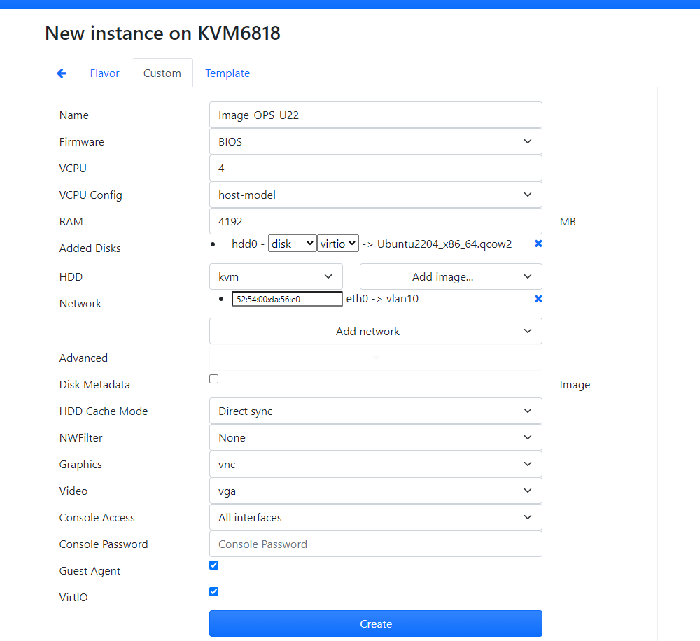
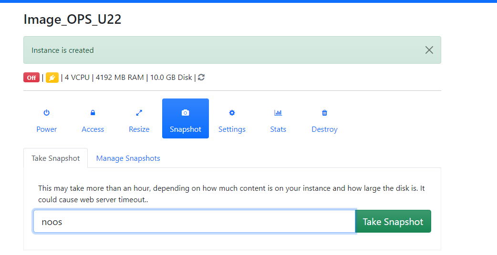
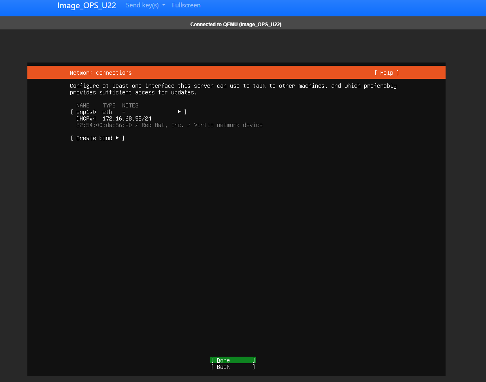
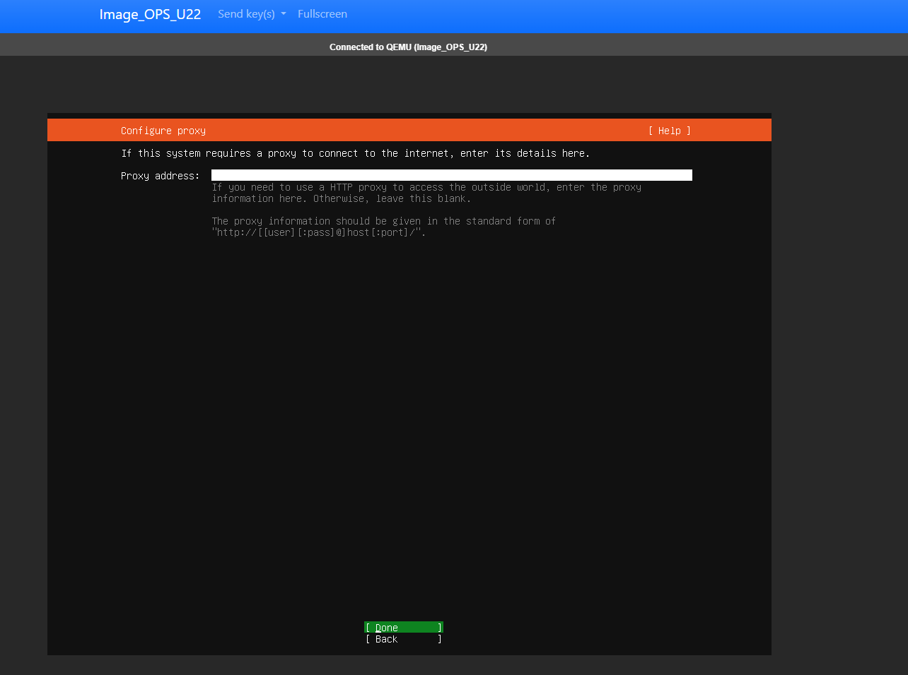

# Hướng dẫn đóng image Ubuntu 22.04 với cloud-init và QEMU Guest Agent (không dùng LVM)

## Chú ý:

- Hướng dẫn này dành cho các image không sử dụng LVM
- Sử dụng công cụ virt-manager hoặc web-virt để kết nối tới console máy ảo
- OS cài đặt KVM là Ubuntu 22.04
- Hướng dẫn bao gồm 2 phần chính: thực hiện trên máy ảo cài OS và thực hiện trên KVM Host

## Phần 1: Tạo mới VM Ubuntu 22.04 (WebvirtCloud)

### Bước 1: Tạo mới disk
- Thực hiện chạy lệnh khởi tạo volume sử dụng: `qemu-img`

```sh
qemu-img create -f qcow2 /kvm/Ubuntu2204_x86_64.qcow2 10G
```


### Bước 2: Tạo mới VM với cấu hình 2 vCPU, 2 GB RAM



### Bước 3: Snapshot VM (NoOS)



### Bước 4: Mount bản cài Ubuntu 22.04


### Bước 5: Khởi động VM


### Bước 6: Truy cập Console


### Bước 7: Cài đặt Ubuntu 22.04 với các lựa chọn như sau

Chọn `English`


Chọn `Continue without updating`


Chọn `Done`


Chọn `Done`


Chọn `Done`



Chọn `Done`



Chọn `Use an entire disk` > `Done`. Lưu ý: KHÔNG DÙNG OPTION THIẾT LẬP DISK dạng LVM


Chọn `Done`


Chọn `Continue` để tiếp tục.


Điền các thông tin cho máy ảo. User mặc định được sử dụng là ubuntu.


Chọn cài đặt `Install OpenSSH Server`.


Bỏ qua các option, kéo xuống chọn `Done`.


Quá trình cài đặt Ubuntu 22.04 bắt đầu.


Chọn `Cancel update and reboot`, lưu ý ĐỢI VM REBOOT VÀO ĐƯỢC OS RỒI MỚI THỰC HIỆN BƯỚC TIẾP THEO


Kết quả


### Bước 8: Tắt VM, chỉnh lại BOOT OPTION


### Bước 9: Truy cập VM, kiểm tra các dịch vụ

Login


Kiểm tra dịch vụ SSH


Lưu ý nếu dịch vụ SSH không khởi động được, thực hiện
```
sudo ssh-keygen -A
sudo systemctl restart sshd
```

Kết quả


### Bước 10: Tắt VM, tạo Snapshot `PreSetupOS`


### Bước 11: Chỉnh sửa file XML VM

Lưu ý:
- Chỉnh sửa file .xml của máy ảo, bổ sung thêm channel trong (để máy host giao tiếp với máy ảo sử dụng qemu-guest-agent), sau đó save lại

Truy cập `Settings` > `XML` > `EDIT SETTINGS`


Nếu đã tồn tại channel đổi port channel này về port='2' và add channel bình thường


Định dạng
```
<devices>
<channel type='unix'>
    <target type='virtio' name='org.qemu.guest_agent.0'/>
    <address type='virtio-serial' controller='0' bus='0' port='1'/>
</channel>
</devices>
```
## Phần 2: Chuẩn bị môi trường Image Ubuntu 22.04

### Bước 1: Thiết lập SSH
Login ssh với tài khoản `ubuntu`, chuyển user sudo
```
sudo su
```

Đặt mật khẩu cho root
```
passwd
Enter new UNIX password: <root_passwd>
Retype new UNIX password: <root_passwd>
```


Cấu hình cho phép ssh bằng user root /etc/ssh/sshd_config
```
sed -i 's/#PermitRootLogin prohibit-password/PermitRootLogin yes/'g /etc/ssh/sshd_config

service sshd restart
```

Disable firewalld
```
systemctl disable ufw
systemctl stop ufw
systemctl status ufw
```

Tắt VM thưc hiện snapshot 
```
init 0
```

Login lại bằng user root

Xóa user cloud
```
userdel cloud
rm -rf /home/cloud
```


### Bước 2: Điều chỉnh Timezone

Đổi timezone về `Asia/Ho_Chi_Minh`
```
timedatectl set-timezone Asia/Ho_Chi_Minh
```

Bổ sung env locale
```
echo "export LC_ALL=C" >>  ~/.bashrc
```

### Bước 3: Disable ipv6

Thực hiện
```
echo "net.ipv6.conf.all.disable_ipv6 = 1" >> /etc/sysctl.conf 
echo "net.ipv6.conf.default.disable_ipv6 = 1" >> /etc/sysctl.conf 
echo "net.ipv6.conf.lo.disable_ipv6 = 1" >> /etc/sysctl.conf
sysctl -p
```

Kiểm tra
```
cat /proc/sys/net/ipv6/conf/all/disable_ipv6
```

Lưu ý: Kết quả ra `1` => Tắt thành công, `0` tức IPv6 vẫn bật

### Bước 4: Kiểm tra và xóa phân vùng Swap

Kiểm tra swap:
```
cat /proc/swaps

Filename                                Type            Size    Used    Priority
/swap.img                               file            2209084 780     -2
```

Xóa swap
```
swapoff -a
rm -rf /swap.img
```

Xóa cấu hình swap file trong file /etc/fstab
```
sed -Ei '/swap.img/d' /etc/fstab
```

Kiểm tra lại:
```
free -m
              total        used        free      shared  buff/cache   available
Mem:            981         134         223           0         623         690
Swap:             0           0           0
```

### Bước 5: Cập nhật gói, update OS

```
apt-get update -y 
apt-get upgrade -y 
apt-get dist-upgrade -y
apt-get autoremove 
```


### Bước 6: Cấu hình để instance báo log ra console, đổi tên Card mạng về eth* thay vì ens, eno
```
sed -i 's|GRUB_CMDLINE_LINUX=""|GRUB_CMDLINE_LINUX="net.ifnames=0 biosdevname=0 console=tty1 console=ttyS0"|g' /etc/default/grub
update-grub
```

### Bước 7: Tắt netplan và cài đặt ifupdown

Xóa netplan
```
apt-get --purge remove netplan.io -y
rm -rf /usr/share/netplan
rm -rf /etc/netplan
```

Cài đặt ifupdown
```
apt-get update
apt-get install -y ifupdown
```

Tạo file interface
```
cat << EOF > /etc/network/interfaces
auto lo
iface lo inet loopback
auto eth0
iface eth0 inet dhcp
EOF
```

Lưu ý
- Khởi động lại, kiểm tra SSH

### Bước 8: Tắt VM, tạo snapshot `OSBegin`


## Phần 3: Cài đặt dịch vụ cần thiết cho Image Ubuntu 22.04

### Bước 1: Cấu hình netplug

Để sau khi boot máy ảo, có thể nhận đủ các NIC gắn vào:
```
apt-get install netplug -y

wget https://raw.githubusercontent.com/danghai1996/thuctapsinh/master/HaiDD/CreateImage/scripts/netplug_ubuntu -O netplug

mv netplug /etc/netplug/netplug

chmod +x /etc/netplug/netplug
```

### Bước 2: Disable snapd service
Kiểm tra snap:
```
df -H
```


List danh sách snap
```
snap list
```


Để xóa, ta sử dụng lệnh `snap remove <package>`: `lxd` -> `core18` -> `snapd`
```
snap remove lxd
snap remove core18
snap remove snapd
```

Remove snapd package
```
apt purge snapd -y
```

Xóa các thự mục snap
```
rm -rf ~/snap
rm -rf /snap
rm -rf /var/snap
rm -rf /var/lib/snapd
```

Kiểm tra lại:
```
df -H
```


### Bước 3: Thiết lập gói cloud-init

Xóa file cấu hình cloud-init cũ
```
rm -rf /etc/cloud/
rm -rf /var/lib/cloud/
```
Cài đặt cloud-init
```
apt-get install -y cloud-init
```

Cấu hình user mặc định
```
sed -i 's/name: ubuntu/name: root/g' /etc/cloud/cloud.cfg
```

Disable default config route
```
sed -i 's|link-local 169.254.0.0|#link-local 169.254.0.0|g' /etc/networks
```

Cấu hình datasource, bỏ chọn mục NoCloud bằng cách dùng dấu SPACE, sau đó ấn ENTER
```
dpkg-reconfigure cloud-init
```


Clean cấu hình và restart service

```
cloud-init clean
systemctl restart cloud-init
systemctl enable cloud-init
systemctl status cloud-init
```

Lưu ý: Việc restart có thể mất 2-3 phút hoặc hơn (Nếu quá lâu có thể bỏ qua bước restart cloud-init)

### Bước 4: Cài đặt qemu-agent

Chú ý: qemu-guest-agent là một daemon chạy trong máy ảo, giúp quản lý và hỗ trợ máy ảo khi cần (có thể cân nhắc việc cài thành phần này lên máy ảo)

Để có thể thay đổi password máy ảo bằng nova-set password thì phiên bản `qemu-guest-agent phải >= 2.5.0`

```
apt-get install software-properties-common -y
apt-get update -y
apt-get install qemu-guest-agent -y
service qemu-guest-agent start
```

Kiểm tra phiên bản qemu-ga bằng lệnh:
```
qemu-ga --version
service qemu-guest-agent status
```
### Bước 5:Cài đặt CMDlog và  welcome Display
```
curl -Lso- https://raw.githubusercontent.com/thang290298/Ghi-chep-Logs/main/CMD-Logs/cmdlog.sh | bash
wget https://raw.githubusercontent.com/thang290298/Create-images-Openstack/main/Linux-Login.sh -O /etc/profile.d/linux-login.sh && chmod +x /etc/profile.d/linux-login.sh

```
Log out rồi login lại kiểm tra:
  - Log cmd: /var/log/cmdlog.log
  - Giao diện sau khi login:
      ```
    Welcome to Cloud365 | nhanhoa.com

    Tue 23 Mar 2221 03:04:17 PM +07

    ______ __                   __ _____  _____  ______
    / ____// /____   __  __ ____/ /|__  / / ___/ / ____/
    / /    / // __ \ / / / // __  /  /_ < / __ \ /___ \
    / /___ / // /_/ // /_/ // /_/ / ___/ // /_/ /____/ /
    \____//_/ \____/ \__,_/ \__,_/ /____/ \____//_____/

    * Trang chu NhanHoa : https://nhanhoa.com/
    * Cloud365          : https://cloud365.vn/
    * Portal            : https://portal.cloud365.vn/
    * Huong dan su dung : https://support.cloud365.vn/
    * Email ho tro      : support@nhanhoa.com

    *----------------------------------------------------*

    root@cloud:~# 
    ```
Kiểm tra lỗ hổng CVE-2221 và dọn dẹp
```
sudoedit -s /
```
- Kết quả trả ra như sau:
```
TH1: "sudoedit: /: not a regular file" -> sudo có lỗ hổng
TH2:  "usage: sudoedit [-AknS] [-r role] [-t type] [-C num] [-g group] [-h host] [-p prompt] [-T timeout] [-u user] file" -> sudo đã được vá.
```
- Clear toàn bộ history
```
apt-get clean all
rm -f /var/log/wtmp /var/log/btmp
> /var/log/cmdlog.log
history -c

```
- Tắt VM
```
init 0
```
### Bước 7: Tắt VM và tạo Snapshot (U22Blank)


## Phần 4: Nén Image Ubuntu 22.04 và tạo Image trên Openstack


### Bước 1: Xử dụng lệnh virt-sysprep để xóa toàn bộ các thông tin máy ảo

```
virt-sysprep -d OPS_Template_ubuntu2224
```

### Bước 2: Tối ưu kích thước image:

```
virt-sparsify --compress --convert qcow2 /var/lib/libvirt/../Images/OPS_Template_ubuntu2224.qcow2 OPS_Template_ubuntu2224
```

### Bước 3: Upload image lên glance và sử dụng

```
glance image-create --name OPS_Template_ubuntu2224 \
--file /root/image-create-ops-test/OPS_Template_ubuntu2224.raw \
--disk-format raw \
--container-format bare \
--visibility=public \
--property hw_qemu_guest_agent=yes \
--min-disk 10 --min-ram 1024 --progress
```